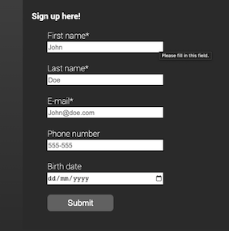

## README - Semester assignment 1 - Forms

### What the project does  
Familiarize myself with forms elements and implementaions of forms. 

### Why the project is useful  
Semesterassignment 1, for Kristiania FFU1100
	
### How users can get started with the project  
Help yourselves from the files in the [:root folder][] 

### Where users can get help with the project  
Your´re probably best of asking someone on the [World Wide Web](www.google.com).

### Who maintains and contributes to the project  
Contributors:  
* Author: Simon Winter  
	* E-mail: simon-winter@outlook.com
	* Git Hub-Repos: [SimonADW](https://github.com/SimonADW/230825-html-forms)

### Related Links
Netlify: [Semesterassignment1 - Forms](https://aquamarine-bunny-471711.netlify.app)  
GitHub: [Forms repository](https://github.com/SimonADW/230825-html-forms)

[Simon Winter](https://github.com/SimonADW)

[:root folder]: ./	
